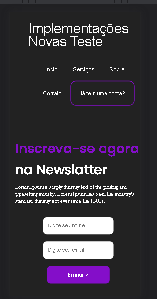

projeto basicamente css, testando e treinando certas funções, bem como demonstração de seu possivel uso ( menu ). 

:nth-child
 
:last-child:hover
 
::after
 
:hover::after
 
[type=""]:hover

 
transform: scaleX();
 
transform-origin: ;
 
transition: ;

<h1>Versão mobile</h1>

<h1>Versão Pc</h1>

